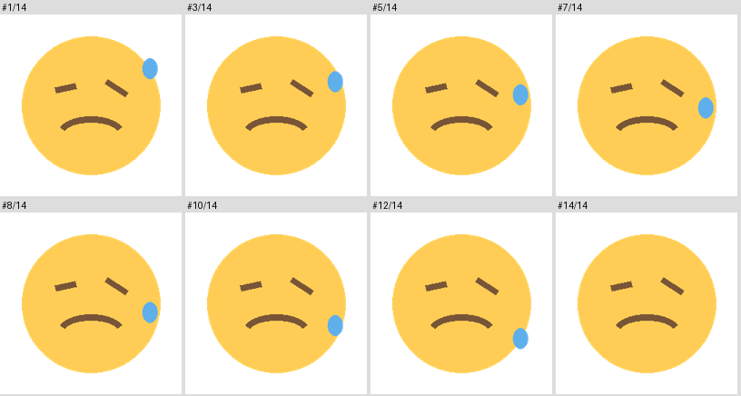

<div align="right"><a href="README.md">English</a> · <strong>简体中文</strong></div>

# 给 Claude Code 与 ChatGPT 配一套会发的表情包

让 AI 助手拥有一个可用的表情包库：按情绪挑一张，直接发进对话里，就像真人甩一张反应图。
本仓库提供的是**机制与规范，不是素材**——一份技能文件、六个维护脚本，以及每天真实使用后
沉淀下来的规则。


*上图是真实会话。其中的表情包来自作者的私人素材库，**并不随本仓库分发**，
详见[换成你自己的素材](#换成你自己的素材)。*

技能本体采用跨平台的 [Agent Skills](https://github.com/anthropics/skills) `SKILL.md`
格式，Claude Code、Codex、ChatGPT、Cursor、Gemini CLI 都能读取。**投递能力已在 Claude Code
与 ChatGPT 两个桌面端实测通过**——两者都自带「把本地图片放进对话」的工具，因此不需要托管、
不需要上传任何东西。其他客户端见[我的客户端能用吗](#我的客户端能用吗)。

## 仓库里有什么

```
skills/sticker-reply/SKILL.md      技能本体：何时发、发多密、如何维护
scripts/build-index.mjs            候选清单；--check 校验；--hook 控制体积
scripts/count-usage.mjs            从本地会话记录统计真实投递次数
scripts/contact-sheet.py           每张动图抽 8 帧，让你按完整动作打标签
scripts/normalize-width.py         统一宽度，可还原，不损坏动画
scripts/serve-stickers.mjs         本地环回 HTTP 服务，供没有文件投递工具的客户端使用
scripts/make-sample-stickers.py    绘制随仓库附带的四张占位素材
stickers/tags.json                 情绪词表 + 每张素材的标签
docs/findings.md                   规则背后的渲染与成本实测数据
```

**环境要求**：Node 18+、Python 3.8+ 与 [Pillow](https://pillow.readthedocs.io/)（仅图像
脚本需要）。没有其他依赖，不需要注册任何服务，不回传任何数据。

## 真正难的地方

发一张图只要一行代码。让它**不惹人烦**才是难点，也正是本仓库要解决的：

**动图不能按首帧打标签。** AI 读取 GIF 时只能看到第一帧，而动图的含义往往取决于动作走向
与结尾表情。对一个当时有 126 张素材的库逐张复核后，**修正了 30 个错误标签**——其中一张
开头是捂脸、结尾是星星眼，长期被当作「得意」发了 69 次，实际含义是「感动落泪」。
`contact-sheet.py` 会把 8 帧拼成一张联系表，让你看着完整动作打标签：



**常用的那几张会被刷烂。** 同一个库里，**前 7 张占了全部 1393 次投递的 38%**，而 36 张
一次都没被发过。`count-usage.mjs` 直接从本地会话记录中统计真实投递次数——不需要任何运行时
记账、没有状态要重置——每个标签内部按「用得最少的排最前」，冷门自动浮出、热门自动沉底。

**索引会悄悄吃掉上下文。** 把整份清单写进系统提示或记忆文件，成本**会随素材数量线性增长**：
136 张时已经 8.9 KB，几百张就不可接受了。`build-index.mjs --hook` 在会话开场只注入每个标签
最冷门的几张，**无论库多大都稳定在约 4 KB**，并在后台刷新统计，让下次会话换一批候选。

**一张过大的图会毁掉阅读节奏。** `normalize-width.py` 把整库统一到同一宽度，保留动画帧速
与透明背景，原图自动备份，可随时还原。

**发送密度其实是两个问题。** 用一条「每 N 行发一张」的统一规则会得到完全相反的效果：干活
过程中的图被一划而过，而真正会被阅读的汇报反而没有图。技能里给出的是实战验证过的拆分
方式——整段干活过程只发一到两张，汇报则固定开头一张、结尾一张。

## 安装

```bash
git clone https://github.com/AkxDing/claude-emoji-stickers.git
cd claude-emoji-stickers
```

安装 Pillow，建议放在虚拟环境里（较新的 macOS、Debian、Ubuntu 会按
[PEP 668](https://peps.python.org/pep-0668/) 拒绝直接往系统 Python 里装包）：

```bash
python3 -m venv .venv && source .venv/bin/activate   # Windows: .venv\Scripts\activate
pip install pillow
```

用 `pipx`、`uv`、`brew install pillow`、`apt install python3-pil` 同样可以。

安装技能：

```bash
# macOS / Linux
mkdir -p ~/.claude/skills && cp -r skills/sticker-reply ~/.claude/skills/
```

```powershell
# Windows PowerShell
New-Item -ItemType Directory -Force "$HOME\.claude\skills" | Out-Null
Copy-Item -Recurse skills\sticker-reply "$HOME\.claude\skills\"
```

打开 `~/.claude/skills/sticker-reply/SKILL.md`，把开头的 `<KIT>` 替换成你 clone 的路径——
技能是从技能目录加载的，而脚本在仓库里，助手需要知道仓库在哪。

先用自带的占位素材确认能跑通：

```bash
node scripts/build-index.mjs --check
```

换成自己的素材（见下文）之后再跑：

```bash
python scripts/normalize-width.py       # 统一宽度
node scripts/build-index.mjs --check    # 校验标签、格式、空悬条目
node scripts/count-usage.mjs            # 仅 Claude Code；启用冷门优先轮换
```

### 控制索引体积（推荐）

加一个会话开场钩子，让每次会话拿到一份体积封顶的候选清单。Claude Code 写在
`~/.claude/settings.json`：

```json
{
  "hooks": {
    "SessionStart": [
      { "hooks": [{ "type": "command", "command": "node /path/to/scripts/build-index.mjs --hook", "timeout": 15 }] }
    ]
  }
}
```

钩子会打印候选清单（几 KB，其中包含素材库的绝对路径），并在后台启动一次用量刷新——刷新是
异步的，历史会话很多时可能需要几十秒，但不会阻塞会话开始。

⚠️ 钩子进程**不会继承**你终端里的环境变量：素材库放在仓库外时，要把 `STICKER_DIR` 写进
`command` 里。客户端没有钩子机制时，手动跑同一条命令，把输出粘贴进对话开场会加载的文件。

## 换成你自己的素材

`stickers/` 里的十二张示例来自微软的 [Fluent Emoji](https://github.com/microsoft/fluentui-emoji)，
MIT 许可（详见 `NOTICE`），只为证明流程能跑通。另外 `make-sample-stickers.py` 会现画几张
朴素的动图，供你试用抽帧联系表那套流程。

请替换掉它们：标准 emoji 当表情包并不好用，因为表情包的意义正在于「有张脸、有个动作」。反应类动图在 [giphy.com](https://giphy.com)、[tenor.com](https://tenor.com)
上很好找；建议挑定一种画风并保持统一，**同一个角色的库比一堆互不相干的梗图耐看得多**。
**你收集的素材版权由你自己负责**——反应动图通常改编自受版权保护的作品，自用没问题，但不
适合放进公开仓库再分发。

每张素材的入库流程：

1. 放进 `stickers/` 下任一目录（目录只是存放位置）。
2. `python scripts/contact-sheet.py <目录>/<文件>`，看那 8 帧。
3. 在 `stickers/tags.json` 里加一行 `"<目录>/<文件>": ["标签", "标签"]`，标签取自 `_vocabulary`。
4. `python scripts/normalize-width.py <目录>/<文件>`
5. `node scripts/build-index.mjs --check`

检索一律走标签、不走目录，因此一张图可以同时服务多种情绪。

### 可配置项

| 变量 | 默认值 | 作用 |
|---|---|---|
| `STICKER_DIR` | `<仓库>/stickers` | 素材库位置。素材放在仓库外时必须设置，五个脚本都读它 |
| `STICKER_WIDTH` | `250` | `normalize-width.py` 的目标宽度 |
| `STICKER_HOOK_TOP` | `5` | `--hook` 每个标签注入几张 |
| `CLAUDE_PROJECTS_DIR` | `~/.claude/projects` | `count-usage.mjs` 去哪里找会话记录 |

### 隐私说明

`count-usage.mjs` 会读取本地的 Claude Code 会话记录，但**只提取 `SendUserFile` 的图片路径
与各自出现次数**：不读取对话正文、不读取其他工具的参数、不读取任何文件内容。产物
`stickers/usage.json` 只是一份 `{路径: 次数}` 映射，且已被 gitignore。

## 我的客户端能用吗

素材库、打标签与轮换都只是文件和脚本，在哪都能跑。客户端唯一需要提供的是**把图显示
出来的能力**，而这只有两种形态：

**A. 有「把本地文件放进对话」的工具。** 两个客户端都有，而且都是首选路线：助手只传一个
路径，不上传、不托管，每张约 50 token，因为只有路径在传输。

- **Claude Code 桌面端** —— `SendUserFile({ files: ["…/happy/wave.gif"] })`。已实测：
  GIF 会循环播放，PNG 与 JPG 正常显示，SVG 不显示。
- **ChatGPT 桌面端** —— `view_image({ path: "…/happy/wave.gif" })`，它的内置看图工具。
  2026-09-20 实测：直接读取本地文件并在会话里显示，不需要任何额外依赖、不需要服务、
  与 Python 或 ImageMagick 无关。

**B. 能渲染 markdown 图片。** 多数聊天客户端都可以。跑起仓库自带的本地服务，助手只要
写一行 ``：

```bash
node scripts/serve-stickers.mjs
```

不需要账号、不需要订阅、不需要公网部署、零依赖——它只监听 127.0.0.1，且只对外提供素材
文件本身。

**没有文件工具的客户端，一分钟即可自测**：把服务跑起来，然后**让助手原样输出**这一行（不要放进代码块）——
``。**看到图就说明这个客户端能用；
只看到一条链接就说明不能。** 注意要让**助手**输出，而不是自己粘贴：很多客户端只渲染回复里的
markdown，不渲染你自己发的消息。

⚠️ **网页类客户端与 `127.0.0.1`**：客户端自身走 https 时，浏览器默认会拦截页面里的普通
http 图片（混合内容），因此即使该客户端本身能正常显示图片，这个本地地址也会失败。若自测中
本地地址不行、而 `https://…` 的图片能显示，就把素材改用 https 提供（任何隧道或静态托管都
可以），并把技能里的地址前缀换成它。

目前已知：

| 客户端 | 结果 |
|---|---|
| **Claude Code 桌面端** | **方式 A 可用**（GIF 会循环播放）；方式 B 不可用，它会拦截回复里的图片地址 |
| **ChatGPT 桌面端** | **方式 A 可用** —— 用它内置的 `view_image` 工具直接读本地路径，2026-09-20 实测，**首选这条**。方式 B 也可用，但只限 https：助手输出的 `https://` 图片会内联显示，`http://127.0.0.1` 不行 |
| 纯终端 | 只会看到文件卡片或一条链接 |

其余客户端均未实测，欢迎
[提 issue](https://github.com/AkxDing/claude-emoji-stickers/issues) 告诉我们你用的客户端
与实际效果。

### 如果你的客户端需要一个 https 地址

**客户端有文件工具的话，整节可以跳过**——Claude Code 与 ChatGPT 都有，方式 A 不需要地址、
不需要服务、不需要托管。

**素材库始终放在你自己硬盘上**——收集、打标签、轮换全程不涉及上传任何东西。只有方式 B
需要一个地址，而客户端自身走 https 时可能拒绝 `http://127.0.0.1`（混合内容；
且自 Chrome 145 起，访问本地回环地址还要过一道权限提示）。按下面的顺序往下试，**从最私密
的开始，能用就停**：

1. **直接用本地服务**：先试 `http://127.0.0.1:8787`，部分客户端是允许的。**什么都不出你的
   电脑。**
2. **本地服务 + 隧道**：`cloudflared tunnel --url http://localhost:8787`（或任意同类工具）
   能给出一个 https 地址，且不需要注册账号。**文件依然只在你硬盘上**，对外可达的只是那个
   地址；缺点是它每次重启都会变，变了要改技能里的地址前缀。
3. **公开地址**：对象存储、静态托管，或者一个公开 GitHub 仓库的 raw 地址：
   `https://raw.githubusercontent.com/<你>/<仓库>/main/stickers`（jsDelivr 镜像同样的文件：
   `https://cdn.jsdelivr.net/gh/<你>/<仓库>@main/stickers`）。零运维，但 ⚠️ **这等于把素材
   公开了**，所以只适用于你有权分发的素材。本仓库自带的示例就可以这样访问，想先把流程跑通
   可以直接指向它。

> ChatGPT 的 MCP 不是绕过这一步的捷径：它只能连远程 HTTPS 服务（不支持本地 stdio），还
> 需要付费套餐并开启开发者模式。

## 参与贡献

告诉我们哪些客户端能显示表情包，是最有价值的贡献：跑一遍上面那个一分钟自测，然后开一个
issue，写明客户端名称与版本、动画是否播放，并附一张截图。提 bug 时附上操作系统、Node 与
Pillow 版本会修得更快。

---

MIT 许可。上文引用的数字来自一个真实的 136 张素材库与 1393 次投递记录；你的数字会不同，
但会遇到的坑是一样的。
